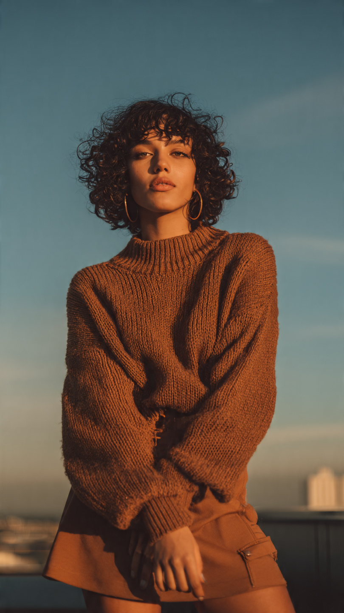
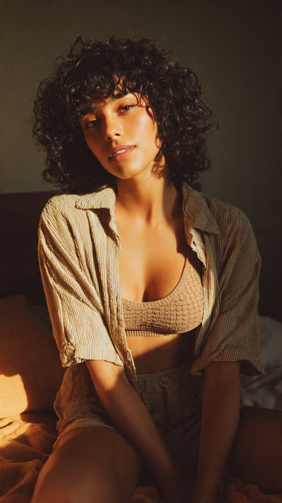

<!DOCTYPE html>
<html lang="pt-BR">
<head>
  <meta charset="UTF-8" />
  <meta name="viewport" content="width=device-width, initial-scale=1.0" />
  <title>Portfólio | Modelo</title>
  <link href="https://fonts.googleapis.com/css2?family=Playfair+Display:wght@400;600&family=Inter:wght@300;400;600&display=swap" rel="stylesheet">
  
</head>
<body>

<header>
  

  

    <h1>Modelo Editorial & Fashion</h1>
    
Modelo profissional com foco em moda, beleza e lifestyle. Estilo natural, elegante e contemporâneo.

    <a href="#contato" class="btn">Contato</a>
  

</header>

<section>
  <h2>Sobre</h2>
  
Experiência em editoriais, campanhas publicitárias, fotografia artística e conteúdo digital. Facilidade em atuar diante das câmeras e interpretar diferentes conceitos visuais.

  

    
<strong>Altura</strong> 1,72m

    
<strong>Medidas</strong> 86 • 62 • 90

    
<strong>Olhos</strong> Castanhos

    
<strong>Cabelo</strong> Cacheado • Castanho escuro

  

</section>

<section>
  <h2>Galeria</h2>
  

    

    

    

     

  

</section>

<section>
  <h2>Trabalhos</h2>
  

    
Editorial de Moda

    
Campanhas Lifestyle

    
Beleza & Skincare

    
Conteúdo Digital

  

</section>

<section id="contato">
  <h2>Contato</h2>
  
Email: henriquedavidson11@gmail.com Instagram: @dudu_duu_jc

</section>

<footer>
  © 2026 Portfólio da Modelo
  Design editorial minimalista
</footer>

</body>
</html>
